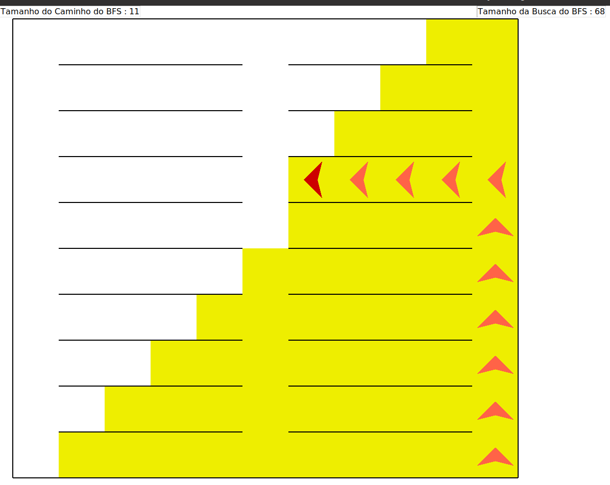
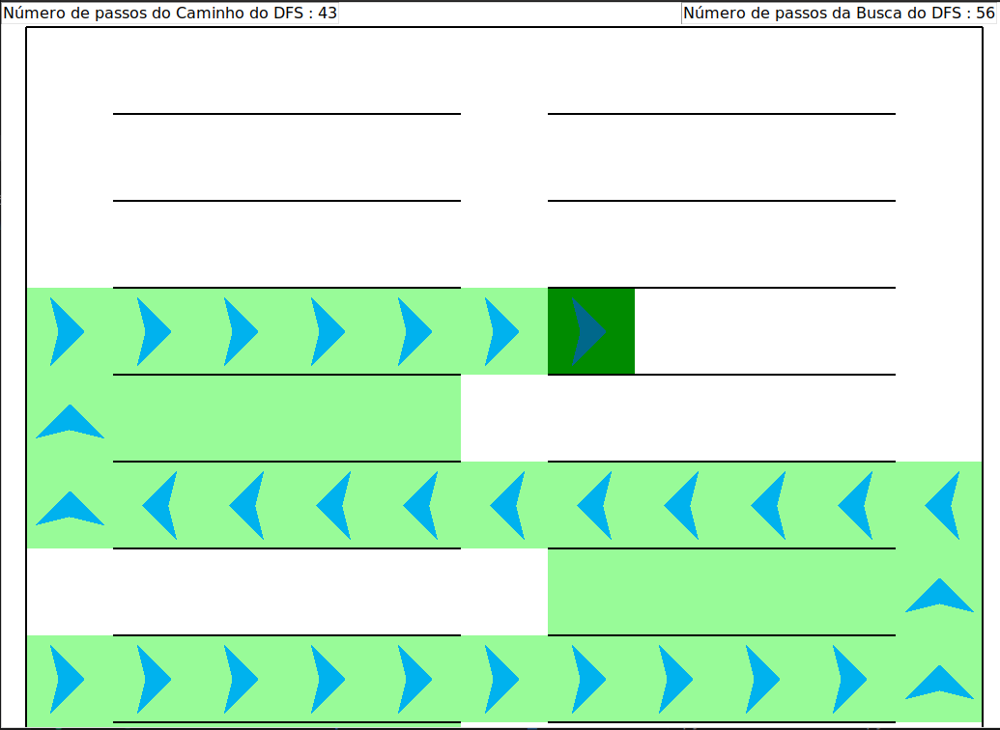

# Sala de aula

**Número da Lista**: N/A<br>
**Conteúdo da Disciplina**: Grafos1<br>

## Alunos
|Matrícula | Aluno |
| -- | -- |
| [Ailton Aires Amado](https://github.com/ailtonaires) | 18/0011600 |
| [Gustavo Duarte Moreira](https://github.com/gustavoduartemoreira) | 20/0038141 |

## Sobre 
O projeto consiste em um labirinto alterado para se parecer com uma sala de aula onde é apontado para a pessoa o local vazio onde ela deve sentar, para verificar qual o melhor caminho a ser tomado são aplicados os algorítimos de busca em largura e profundidade. 

## Screenshots


Resultado da busca em largura realizada.



Resultado da busca em profundiade realizada.


Resultado da busca em largura realizada.


Resultado da busca em profundiade realizada.


## Instalação 
**Linguagem**: python<br>
**Framework**: N/A<br>

***Pre-requsitos***

Possuir o python3 instalado na máquina.


## Uso 
**Clonar o repositório**
```
    git clone https://github.com/projeto-de-algoritmos/Grafos1_ClassRoomMaze.git
```
**Entar o repositório**
```
    cd Grafos1_ClassRoomMaze/src
```
**Executar o comando**
```
    python3  bfsXdfs.py
```
## Outros 
Quaisquer outras informações sobre seu projeto podem ser descritas abaixo.


